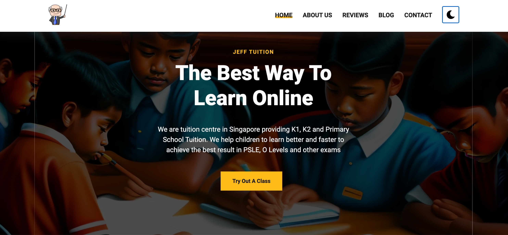

Jeff Tuition is one of the leading tuition agencies in Singapore. We have full time and part time tutors who are experts in their respective fields, and we also ensure that they have the relevant work experience and knowledge of testing strategies for different levels including class 10 and 12. 

These teachers know how to teach students from all backgrounds including math, science, arts and other streams of education. In addition to this, our teachers are proficient in both English and Chinese.

For over five years we have been providing high quality learning services to students who want to learn from home or outside school hours by their choice, but also for parents who are unable to provide them with private lessons due to other commitments in life.

We have close to 50 tutors on our platform, so you can be sure that there’s someone here who can help you with your needs. We recommend that you take advantage of this variety and contact us if you have any questions or concerns!